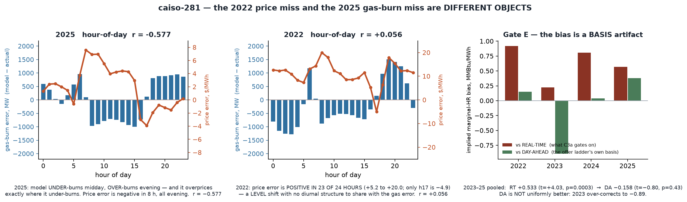

# RESULT caiso-281 — the 2022 price miss and the 2025 gas miss are **TWO OBJECTS, NOT ONE**; and CAISO's marginal-HR bias does not survive the DA basis

**Lane:** CAISO calibration · **Date:** 2026-09-13 · **LP spent: ZERO** · **Keeper unchanged**
(`2026-09-12-caiso-275-gascoupling`) · **Nothing promoted, no mechanism cell moved, no ISO
determination touched.**
**Charter:** `docs/PRECOMMIT-caiso281-is-the-marginal-hr-bias-a-measured-input-defect-2026-09-13.md`
· addenda `ADDENDUM-caiso281-the-diurnal-coincidence-leg-2026-09-13.md` (Gate D) and
`ADDENDUM-caiso281-gate-E-the-DA-basis-leg-2026-09-13.md` (Gate E) — **each pushed before its own
number existed.**
**Predecessor:** `docs/RESULT-caiso280-the-envelope-binds-above-the-actuals-2026-09-13.md`.

---

## §1 — THE ANSWERS

> **(a) Do the 2025 gas-burn error and the 2022 price error have a common root? NO. They are
> structurally different objects — one is SHAPE, the other is LEVEL — and where they overlap they
> run OPPOSITE.**
>
> **(b) Is the +1.024 marginal-HR bias a measured-input defect? NO. The model's physical heat
> rates are right, confirmed by two independent measured sources.**
>
> **(c) Then what is it? It is very largely a DAY-AHEAD-vs-REAL-TIME BASIS artifact of the test.
> The offer ladder carrying the bias is measured from CAISO's DAY-AHEAD bids; C3a scores it
> against REAL-TIME prices. Re-measured on the ladder's own basis, CAISO's bias goes from
> +0.533 (t = +4.03, p = 0.0003) to −0.158 (t = −0.80, p = 0.43).**

**The handoff §4 direction is dead, and the live question is now the owner's standing §5 rubric
item — which this session has given a MECHANISM rather than an observation.**

## §2 — THE GATES, AS PRE-REGISTERED AND AS THEY READ

| gate | pre-registered rule | measured | verdict |
|---|---|--:|---|
| **A1** order — Spearman(model HR, CAMPD HR), `CC_REGULAR` | OPEN ≤ 0.40 / KILL ≥ 0.70, both years | **0.513** (2022) · **0.568** (2025); lowest band 0.635 · 0.684 | **INDETERMINATE — route does NOT open** |
| **A2** level — cap-wtd Δ, lowest CC band | reported, not gated | **+0.131** (2022) · **+0.240** (2025) MMBtu/MWh | physical HR is **RIGHT** |
| **B** identity — where the +1.024 lives | reported, not gated | model marginal HR **8.529** vs measured base **7.368–7.442**; actual implied marginal **7.505** | it is the **offer ladder above base** |
| **C** common root at LP-row grain | KILL if \|r\| < 0.20 **and** \|ρ\| < 0.20 | **r = +0.553**, ρ = +0.464 (n = 82) | **PASS — a persistent plant-level object exists** |
| **D** diurnal coincidence, 288 buckets | COINCIDENT ≥ +0.35 both yrs / KILL if \|r\| < 0.20 either | **2022 −0.322 · 2025 −0.157** | **KILL** |
| **E** DA basis, CAISO 2023–25 | EXPLAINS if \|mean\| ≤ 0.15 **and** \|t\| < 2.0 | **mean −0.158**, **t −0.797**, p 0.43 | **INDETERMINATE — by 0.008 on the magnitude limb** |

**Two thresholds were missed and NEITHER was moved.** Gate A1 landed between its bands; Gate E's
`t` limb passed decisively while its magnitude limb missed **0.15 by 0.0083**. Both read
INDETERMINATE, and the charter's own words govern: *"An indeterminate does not open the route."*
Reporting E as a pass because 0.158 ≈ 0.15 is exactly the threshold-moving caiso-280 refused.

**Gate D's PREDICTED SIGN WAS WRONG.** The addendum predicted `r > 0` and both years came back
**negative**. The prediction was written down first precisely so it could fail in public.

**G-REPRO, both legs, exact.** Model 2022 load-weighted price reproduces the committed
**94.069** to the third decimal; the actual hourly series reproduces the committed bench `rt`
**79.07** at **79.072**; Gate E's RT leg reproduces caiso-277's **+0.534** at **+0.5334**.
*One correction against myself:* the Gate D addendum's stop named `rt_lw` **84.490** and my first
pass returned 83.759. That gap is **entirely the weight** — `rt_lw` is weighted by actual load, I
used the model's demand — not the series, which matches `rt` exactly. Gate D's metric correlates
hourly deviations and is invariant to any annual weighting scalar, so nothing was adjusted to fit.

## §3 — WHY THEY ARE TWO OBJECTS (the figure, in words)

**C4-2025's gas error is ~100 % SHAPE.** Decomposing the aggregate hourly error
`E(h) = Σ_p (model_p − actual_p)`: `mean(E)² / mean(E²)` = **0.0002**, i.e. **0.02 % level,
99.98 % shape**. The fleet level is essentially perfect (**+21.9 MW on 5,312.6 MW actual,
+0.41 %**) while `sd(E)` is **1,693 MW**. The shape is a clean duck-curve redistribution, the same
sign pattern in both years: **under-burn midday (h8–h16, −730 to −970 MW), over-burn the evening
and morning ramps (h6, h18–h23, +800 to +960 MW)**.

**2022's price error is LEVEL.** It is **positive in 23 of 24 hours of the day**, +5.2 to
+20.0 $/MWh (only h17 is −4.9), with essentially no diurnal structure — `r = +0.056` at
hour-of-day grain against the gas error. It is **+1.024 MMBtu/MWh × the gas price**, which is
caiso-276 §3's object reproduced from a different construction.

**Where they overlap, they run opposite.** In 2025 the model **overprices by +4 to +7 $/MWh in
exactly the midday hours it UNDER-burns gas**, and **underprices in the evening hours it
OVER-burns** — hour-of-day `r = −0.577`. A single mechanism cannot make both errors.

**This finally explains the ×0.92 result mechanically rather than empirically.** A flat multiplier
moves the **level**, which is **0.02 %** of what C4-2025 measures, and it adds gas where the model
has headroom — the evening, where it is already over. So it *must* improve a level-object price
miss and *must* worsen a shape-object gas miss. C3a −5.3 pts and C4 0.298 → 0.308 is the
predicted signature, not a coincidence.

**And the aggregation fact behind it:** only **38.3 %** of the per-plant absolute error survives
summation (`Σ_h|Σ_p e_p| / Σ_h Σ_p|e_p|` = 0.383 in 2025, 0.363 in 2022). C4's gas fit is a
**fleet-total** series (`_cems_gas_hourly_fit` sums over plants before the Pearson/NRMSE), so
**62 % of the plant-level error is reallocation C4 cannot see at all.** Gate C's persistent
plant-level object (r = +0.553) is therefore real **and largely invisible to every scored
criterion** — recorded, not chased.

## §4 — THE HEAT RATES ARE RIGHT, AND THREE SOURCES AGREE

| quantity | value (2022 / 2025) |
|---|--:|
| CAMPD measured `CC_REGULAR` HR, high-load hours, cap-weighted | **7.368 / 7.273** |
| measured offer surface's own `base_hr` (OASIS-derived) | **7.442** |
| model's **lowest** CC offer band, cap-weighted | **7.500 / 7.513** |
| model's **load-weighted marginal** HR (caiso-276 §5c) | **8.529** |
| **actual implied marginal HR** (8.529 − caiso-276's +1.024) | **7.505** |

Two independent measured sources — CAMPD unit heat input, and CAISO's own OASIS bid file — agree
on the CC base rate within **0.17**, and the model sits on it. **There is no rule-14
`[R-ACCURATE]` input defect to repair on this axis**, which closes the one admissible route the
charter was written to find.

The gap is the **ladder above base**: measured bands `econ_low 1.066 / econ_high 1.072 /
peak 1.386`. The market's implied marginal price corresponds to **1.008 × base** — essentially the
efficient CC's own heat rate, no markup. The model clears about one band up.

**Also measured, REPORTED and explicitly OUT of the A1 gate by the charter's §6(4):** `CT_CHP`
offers at **14.068** HR against a CAMPD-measured **9.719** (Δ **+4.35**), on n = 5 plants /
143 MW matched (class total 988–992 MW / 47–49 plants). CHP `heatInput` covers steam, so the
electrical-basis measured rate is *overstated* and the true gap is **wider**. caiso-276 §6 closed
the CT_CHP *ladder* question on the OASIS file's provenance — correctly, and this does not
re-open it, because this is the **base rate** the ladder multiplies, not the ladder. It is named
here as the one unexamined item; it is **not** a lever and was not tested.

**One candidate KILLED on measurement, so a later lane need not raise it:** λ sitting "in a gap"
81–91 % of the time (caiso-276 §5c) is **not** tranche coarseness. The CC ladder carries a median
**8 distinct HR tranches per plant** with a **median adjacent step of 0.008 MMBtu/MWh**. The
ladder is fine-grained; a finer one buys nothing.

## §5 — GATE E: THE BASIS, AND WHAT IT DOES AND DOES NOT SHOW

`dHR = (price_model − price_actual) / gas`, caiso-277's construction unchanged, CAISO only:

| basis | n | mean | sd | t vs 0 | p | months > 0 |
|---|--:|--:|--:|--:|--:|--:|
| **RT** (what C3a gates) | 36 | **+0.533** | 0.794 | **+4.03** | **0.0003** | **75.0 %** |
| **DA** (the ladder's own) | 36 | **−0.158** | 1.192 | **−0.80** | 0.43 | **50.0 %** |

Per year: RT **+0.917 / +0.225 / +0.805 / +0.571** (2022–25) → DA **+0.149 / −0.890 / +0.037 /
+0.377**. **2022 alone goes from +0.917 with t = +5.56 and 12 of 12 months positive, to +0.149
with t = +0.94, p = 0.37.**

**What this shows:** the *statistically significant, CAISO-specific, positive* bias caiso-277
isolated is **not present on the day-ahead basis** — 75 % of months positive becomes exactly
50/50, and a t of +4.03 becomes −0.80. The offer ladder is derived from `PUB_DAM_GRP`
**day-ahead** bids (`_provenance.source`), so DA is the ladder's native basis.

**What this does NOT show, stated at full magnitude:**
1. **DA is not a rescue.** 2023 over-corrects hard (−0.890), and the DA standard deviation is
   **50 % larger** (1.192 vs 0.794). Trading a biased estimator for a noisier unbiased one is a
   real trade, not a free win.
2. **The gate reads INDETERMINATE**, not EXPLAINS — the magnitude limb missed by 0.0083.
3. **It is an association, not an identification.** Gate E cannot prove the DA–RT premium *causes*
   the gap; it shows the gap is absent on the other basis.
4. **The vintage story is WEAKENED, not supported.** The bias is present across **2023–2025 — the
   very trade years the surface was fitted on**. An in-sample bias argues against register item
   **N-CA-2**'s vintage-asymmetry reading of 2022. Recorded because the addendum required it
   whichever way the number landed.

## §6 — WHAT THIS MEANS, AND THE THREE THINGS THAT NEED THE OWNER

**The lane's honest state is now sharper than "no admissible lever".** The 2022 C3a miss is:
* **not** an import-quantity object (caiso-280, closed and inverted);
* **not** a physical heat-rate object (§4, three sources agree);
* **not** a shared root with C4's gas miss (§3, Gate D KILL — they are anti-correlated);
* **not** a tranche-granularity object (§4, killed);
* it is **the offer ladder above base measured against a different price basis than the one it was
  measured on** (§5).

### Owner item 1 — the rubric ruling (handoff §5), now with a mechanism

The standing question was *"C3a on the DA basis looks better — is that legitimate?"*. The new fact
is that **the model's marginal-cost input is itself a day-ahead-bid surface**, so DA is arguably
its native basis rather than a flattering one. Against that: DA is noisier and over-corrects 2023.
**Not acted on. No benchmark changed, no scorer touched.** Rubric owner's call.

### Owner item 2 — the ×0.92 multiplier, with the C4 cost now stated mechanically

handoff §4 asked for a written case, not a solve, if the lane landed here. It did. The case is
**not** "it improves C3a":
* The CAISO offer bands are a **measured surface with passing derivation gates**
  (G1 capacity reconciliation 0.871, G2 cut robustness all pass). Scaling them by 0.92 moves
  **away from CAISO's own bid data** — refused by rule 14 `[R-ACCURATE]` independently of rule 1
  `[R-STRUCT]` (c)'s sweeping prohibition. That is a *second, stronger* objection than the one on
  the record.
* Its C4 cost is **structural, not incidental**: C4-2025's error is 99.98 % shape, so a level
  multiplier cannot help it and will generally hurt it.
* **The honest reading is that ×0.92 is a hand-sized correction for a BASIS mismatch.** If the
  basis question (item 1) is ruled on, the multiplier's motivation largely disappears.
**No multiplier was re-run at any value** (rule 1 (c)). **Recommendation: rule on item 1 first.**

### Owner item 3 — the parity gate is RED on `main` (handoff §6), and it is now FOUR dirs

`check_registry_payload_parity` fails on **four** tracked bundle dirs, one more than the handoff
recorded: `caiso279_ablate_dswcouple_span` (CAISO), `nyiso230_arm_y2022`, `nyiso231_arm_y2022`,
**`nyiso231_ctl_y2022`** (NYISO). `KEEP_REQUIRED_UNMAPPED_BUNDLES` is deliberately empty, so the
allowlist is not a route. **Nothing was removed** — rule 31 `[R-RETAIN]` makes the promotion call
the owner's, and rule 25 `[R-ISO-SCOPE]` bars a CAISO lane from the three NYISO dirs. Put to the
owner; the NYISO three belong to their own lane.

## §7 — METHOD, AND WHAT WAS NOT DONE

Zero-LP, entirely in the parent (rule 32 `[R-SHARD]` (a)); **no shard launched**, so rule 33
`[R-SHARD-ARCHIVE]` has nothing to sweep and rule 34 `[R-SHARD-PROMOTABLE]` has no bundle to
retrieve. **Nothing was solved, so there is no promotion question to put** (rule 31). No
`ScenarioConfig` field was touched and **no mechanism was tested, so no matrix cell moves**
(rule 28 duty (b) is keyed to testing a mechanism).

Sources, committed only: the keeper payload + bench (`plants[].m` / `plants[].campd`, uint8 CF %),
`hourly/system_<year>.parquet`, `data/raw/_validation-source/actual_lmp_hourly_CAISO.parquet`,
`data/raw/_validation-source/caiso_offer_curve_measured.json`,
`data/raw/campd-unit-level/CA_{2022,2025}.parquet`, and two `run_year(fleet_only=True)` rebuilds
driven by the bundles' own `meta.json` (the rule-29 phase-0 path — no P0/P1, no LP).

**DO-NOT-REDO added by this session:** (i) tranche granularity as the "λ in a gap" explanation —
killed at §4; (ii) CC physical heat rates as a rule-14 repair route — killed at §4, three sources
agree; (iii) a common root between C4's gas error and C3a's price error — killed at Gate D, with
the two objects separately characterised.
