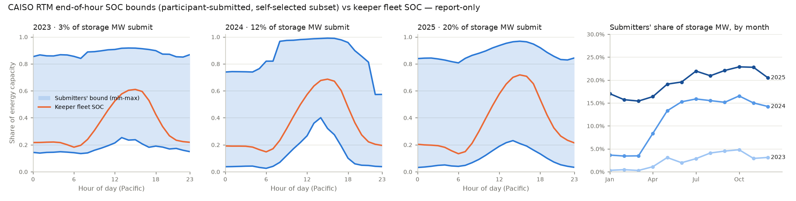

# FINDING — R-CAISO-31 (link 13): OASIS `PUB_RTM_GRP` storage EOH SOC bounds intaken, 2023–25. Report-only.

Keeper `2026-09-30-caiso-r20-overnight` (bundle `rcaiso20_A_span`) is unchanged. **Data intake only: zero LP,
no shard, nothing armed, no `ScenarioConfig` field, no matrix cell moved.** The bound is never a solve input
(rule 13; R-CAISO-28 FINDING §1 point 4).

## 0. Result

| | |
|---|---|
| **Retention** | Earliest RTM trade date served (2026-10-01): **2021-09-01**. **Lost since caiso-281 (2026-09-14):** 2021-08-15 to 08-31. **Lost overall:** everything before 2021-09-01. **2023–25: nothing lost**; 2023-01-01 should age out around late 2027. |
| **Fetched** | 1,095 / 1,096 trade dates (1.7 GB of zips, gitignored). Hole: **2024-07-03** (RTM `ERR_CODE 1000`, the same hole caiso-283 recorded). |
| **Committed** | `data/raw/caiso-rtm-eoh-soc/` (1.0 MB): the EOH rows, the daily storage universe, per-day manifests with source-zip sha256, and SHA256SUMS. |
| **Clean datatype** | `storage-soc-bounds` (CAISO / RTM, per resource-hour; 9,351 / 142,218 / 351,264 rows). No model reader. |
| **Coverage** | Submitters' share of storage injection MW: **2.7 % / 12.2 % / 19.8 %** (2023/24/25); 30 / 62 / 95 distinct resources. |
| **Diagnostic** | At every hour of day, in all three years, the keeper's fleet SOC sits **inside** the submitters' mean bound envelope. The smallest gap is 4 pp, against the lower edge at h13 in 2023. |

## 1. What the diagnostic says, and what it cannot say

- **Envelope shape.** The submitters' mean lower bound rises through the solar hours and is released into
  the evening ramp: 2024 summer h13–15 averages 0.51–0.63 of the ceiling, and by h20 it is ≈ 0.05. That
  repeats R-CAISO-28 §1 on the full span. The upper bound sits at 0.8–1.0 of the ceiling, except in 2024
  overnight (0.57 at h22–23).
- **Pinned windows.** 28.6 % of 2025 submitter resource-hours have max − min ≤ 10 % of the ceiling (10 %
  in 2023–24), at a flat rate across hours of day. Those resources hold a near-fixed SOC all day, which reads
  as a parked or derated resource rather than an arbitrage view. That is relevant to link 14 (SOC outages) and
  not tested here.
- **Keeper comparison is aggregate only.** The masked ids cannot be mapped to model storage units, and
  submitters are a self-selected 3–20 % of MW. "Inside the envelope" therefore says only that the fleet-mean
  trajectory does not contradict what submitters declared on average. It cannot show per-resource
  feasibility, and it is not a fit target. The summer envelope is reported, but the keeper comparison is
  annual only.
- **Clock.** Bounds are binned by the Pacific hour of the bid-interval start; the bound applies at that
  hour's end, which matches the model's end-of-hour SOC at hour h.

No result here moves R-CAISO-24 §5 (closed): the bound is on placement, and the bar has not moved.

## 2. Files

- `scripts/data/extract_caiso_rtm_eoh_soc.py` writes the compact extract from the zips. Per day it asserts
  that the bound is unique per resource-hour and that the bid interval is hourly.
- `scripts/lib/storage_soc_bounds/` (registry + `caiso.py`), `scripts/data/curate_storage_soc_bounds.py`,
  `data/dictionary/schema/storage-soc-bounds.schema.yaml`, registered in `regenerate_clean.py`.
- `tests/curation/test_curate_storage_soc_bounds.py` (4 tests).
- Probe `scripts/probes/_rcaiso31_eoh_soc_diagnostic.py` writes `eoh_soc_diagnostic.json` and the chart.
- `data/raw/caiso-public-bids/README.md`: retention re-measured.

## 3. DO-NOT-REDO

- Do not re-fetch 2023–25 RTM zips to re-read the EOH fields. The committed extract is lossless for them.
- Do not read a single GroupZip response as "dead": `ERR_CODE 1015` is a queue state (caiso-281 2020 Q1 §2).
- Do not use the bound as a solve input, LP floor or fit target (rule 13).

## 4. Owner ruling

Decision card, 2026-10-01 (multi-select). Two of four options were selected:

1. **Close, report-only.** Merge the intake and the FINDING. No consumer, no cell moved. Continue to link 14.
2. **Queue a Run Explorer panel** (display only) that renders the bound envelope next to the keeper's storage
   SOC. Queued as **link 16**, after links 14 and 15.

Not selected: folding the pinned-window observation (§1) into link 14. Link 14 keeps its DMM-only scope, so do
not re-ask about it. Not selected: stopping the chain.
