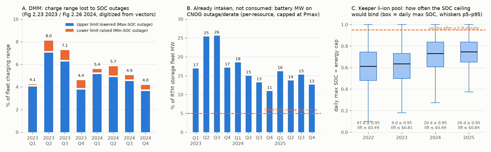

# FINDING — R-CAISO-32: DMM battery SOC-outage series, scoped as a physical availability input (link 14)

Keeper `2026-09-30-caiso-r20-overnight` (bundle `rcaiso20_A_span`, 2022–25), unchanged. **Zero LP, no build,
no shard, no `ScenarioConfig` field, no cell moved.** Scoping only, as the handoff directs.
Probes: `scripts/probes/_rcaiso32_dmm_soc_outage_digitize.py` (the figures, from the PDF vector objects) and
`scripts/probes/_rcaiso32_soc_derate_reach.py` (reach on the keeper + the CNOG MW leg). Outputs committed next
to this file: `dmm_soc_outage_digitized.json`, `soc_derate_reach.json`, `soc_outage_scoping.png`.

## 0. Result

| | 2022 | 2023 | 2024 | 2025 |
|---|--:|--:|--:|--:|
| DMM series published for the year | no | **yes** (Fig 2.23) | **yes** (Fig 2.26) | no (no 2025 special report as of 2026-10-02) |
| Mean share of charge range on SOC outage | — | 5.9 % (DMM text: 5.8) | 5.0 % (DMM text: ~5) | — |
| Keeper days the pool reaches ≥ 95 % of its energy cap | 47 | 9 | 20 | 26 |
| Days a quarterly derate would bind (ceiling or floor) | 187 | 156 | 201 | 179 |
| Energy lost, upper bound (% of annual discharge) | 0.88 | 0.84 | 0.67 | 0.53 |
| Price lift, annual mean / worst day ($/MWh, h18 stack slope) | 0.04 / 0.49 | 0.06 / 0.81 | 0.04 / 0.49 | 0.06 / 0.84 |

2022 and 2025 borrow the 2024 quarters and are labelled so in the JSON.

**The input is admissible and small.** It is a physical derate on the fleet's energy range, it attaches to two LP
channels that already exist, and its whole-year price reach (≤ $0.06/MWh mean, < $1 on the worst day, both
over-stated by construction) sits inside the R-CAISO-24 bound (≤ $0.5 at h18). It is aggregate, digitize-only, and
exists for two of the keeper's four years. Nothing it can do to the gates is visible at the scoring grain.

## 1. The series

DMM Battery Special Reports, "Quarterly average real-time state-of-charge outages": **2023 report Fig 2.23**
(p. 30; the handoff's "Fig 2.26" is the 2024 report's number — in the 2023 report Fig 2.26 is quarterly
mitigation) and **2024 report Fig 2.26** (p. 31). The 2022 report (Jul 2023) does not carry the figure. There is
no 2025 special report; the 2025 Annual Report (p. 98) gives only the MW leg (§4).

What the figure is: operators may lower a battery's upper charge limit or raise its lower charge limit below /
above its Master File energy limits through the **Outage Management System**. The bars are the fleet-sum of those
MWh reductions in the real-time market, quarterly mean; the line is their share of the fleet's aggregate charging
range. Both charts are vector objects in the PDF, so the probe reads the bar heights and the line vertices against
the axis ticks directly (precision ≈ 0.05 pp; the quarterly means reproduce DMM's text to 0.1 pp).

| Quarter | Max-SOC outage (MWh) | Min-SOC outage (MWh) | Share of range | Implied range (GWh) |
|---|--:|--:|--:|--:|
| 2023 Q1 | 689 | 8 | 4.08 % | 17.1 |
| 2023 Q2 | 1,322 | 173 | 7.95 % | 18.8 |
| 2023 Q3 | 1,497 | 206 | 7.11 % | 24.0 |
| 2023 Q4 | 1,089 | 198 | 4.45 % | 28.9 |
| 2024 Q1 | 1,515 | 86 | 5.43 % | 29.5 |
| 2024 Q2 | 1,707 | 287 | 5.69 % | 35.1 |
| 2024 Q3 | 1,817 | 141 | 4.89 % | 40.1 |
| 2024 Q4 | 1,653 | 177 | 4.04 % | 45.3 |

Cross-check: the implied aggregate range (bars ÷ line) runs 17 → 29 GWh through 2023 and 29 → 45 GWh through
2024. The keeper's EIA-860 li-ion pool carries 27.1 GWh (2023) and 40.0 GWh (2024), inside each year's quarterly
span — the digitization and the model fleet agree on scale. The upper-limit leg is 85–99 % of the total; the
lower-limit leg is 0.05–0.8 % of the range.

## 2. Admissibility and where it would attach

**Rule 13.** A pass. It is a physical availability input of the outage-window kind: an OMS card that removes
energy range from the market, not a bid, a target or a residual. The forward story is a fleet derate rate
(quarterly share of range, from multi-year history) applied to whatever fleet a forward year carries — the same
form as a forced-outage rate. It responds to changed conditions through the fleet it multiplies.

**Rule 14 (boundary).** It is fleet-wide. The model carries one li-ion pool per zone, so the only mapping is
pro-rata by energy cap; that misalignment would be documented and the reconciled form is the share itself.
Measured, not estimated — but **digitize-only**: no OMS, OASIS or CNOG series publishes the MWh legs (§4).

**Rule 19 (what already shapes the pool's SOC).**

| Channel | Keeper state | What it does |
|---|---|---|
| `storage_energy_cap` (LP SOC ≤ cap, `(n_storage, hours)`) | annual EIA-860 cap, flat within the year (vintage ramp applies to COD months) | the ceiling this derate would lower |
| `storage_soc_min` (LP SOC ≥ floor) | zero (`caiso_storage_as_reservation = False`) | the floor this derate would raise |
| `caiso_storage_shape_anchor` | **on** | caps charge/discharge **power** at the measured p95 hour-of-day envelope (EIA-930 ÷ EIA-860) — a power channel, so the two do not stack on one phenomenon |
| `caiso_dam_outages` (CNOG) | off; crosswalk carries no battery rows | nothing reaches storage |

A build would be one CAISO-only boolean reading the committed JSON: ceiling `energy_cap × (1 − max_share_q)`,
floor `min_share_q × energy_cap`, both quarterly steps on the existing bound arrays. No new LP structure, no
tuned value, one row and a cell in every shard (rule 28). Years without a series would need a declared proxy
(nearest published year), which is the weak point: two of four keeper years would ride a borrowed number.

## 3. Reach on the keeper (zero LP)

The keeper's li-ion pool rarely touches its ceiling: the median daily peak SOC is 0.61–0.75 of cap, and the
pool reaches 95 % of cap on 9–47 days a year (panel C). A 4–8 % ceiling cut therefore binds on the days the pool
already fills, and only by the part above the new ceiling. Counting every MWh above the ceiling or below the floor
as lost (a re-solved LP would re-time part of it), the annual loss is 0.5–0.9 % of discharge. Spread over
HE17–21 and priced on the R-CAISO-24 Part B gas-stack slope (+$0.5 per 149 MW in 2023, −$0.2 per 131 MW in 2024,
−$1.5 per 766 MW in 2025), the lift is **≤ $0.15/MWh on a binding day, ≤ $0.84 on the worst day, ≤ $0.06 annual
mean**. The sign is up (less stored energy at the peak), which is the direction of the 2023–24 h18 body residual
(−$5.3 / −$1.3, R-CAISO-24 §0) but an order of magnitude short of it, and the slope already over-states the
response (only gas moves). Inside the R-CAISO-24 bound, as the handoff anticipated.

## 4. Is there an underlying series?

- **OMS** itself is not public. The MWh charge-limit cards exist only inside the DMM figure.
- **CNOG (Curtailed and Non-Operational Generator) daily report** — already intaken
  (`data/raw/caiso-dam-outages`, 2023–25). It carries battery resources (177 by id suffix / name) but as **MW**
  curtailments (`PLANT_TROUBLE`, `PLANT_MAINTENANCE`, …); there is no nature-of-work for an energy limit, so it
  is not this series. It is the **MW leg** of battery unavailability, and it is large: per-resource offline MW
  capped at Pmax, over the RTM storage bidding fleet, averages **21 / 14 / 14 %** of fleet MW in 2023/24/25
  (panel B; quarterly 11–26 %). Cross-check: the DMM 2025 Annual Report (p. 98) states battery outages averaged
  ~1,300 MW in 2024 and 2,450 MW in 2025; the CNOG construction gives 1,515 and 2,277 MW. Today none of it reaches
  a solve (crosswalk has no battery rows; `caiso_dam_outages` is off in the keeper), and the fleet-level
  unavailability it describes is already absorbed, behaviourally, by the measured p95 envelope in
  `caiso_storage_shape_anchor` — consuming it as a per-resource derate would require re-deriving that envelope
  net of outages, or it stacks (rule 19).
- **OASIS public bids** (`PUB_RTM_GRP`, R-CAISO-31 extract) carry the EOH SOC bid bounds, a conduct parameter
  (ruled never a solve input, R-CAISO-28 §1 point 4), not OMS limits.
- **CAISO Daily Energy Storage Report** (library archive 2022 → present, daily HTML, system level): bid-in
  charge/discharge capacity, awards, total SOC. Bid-in capacity is self-selected, not a physical derate; the
  SOC series is a fleet trajectory, not a limit. A display candidate for the link-16 panel, not this series.

## 5. Matrix check (rule 28)

No field exists, so there is no cell. The CAISO shard is untouched; `storage_measured_anchors` (K) and
`storage_daily_cycling` (G) are the adjacent adjudicated cells and neither is re-opened. R-CAISO-24 §7 point 1
("aggregated-battery pointer spent on reach") is confirmed from the physical side: the fleet's measured energy
unavailability is ~5 % of range and binds on a few dozen days a year.

## 6. Decision

Nothing to promote. Options put to the owner as a decision card (§7).

## 7. Owner ruling

Decision card, 2026-10-02 (multi-select). Two of four options selected:

1. **Close link 14 report-only.** No field, no cell. The digitized series stays committed beside this FINDING as
   a documented reference input. The chain goes on to link 15 (R-CAISO-33, joint gas re-basis).
2. **Queue a battery-outage census** as a later link (**link 17, R-CAISO-35**, after link 16), zero LP: extend
   the CNOG resource crosswalk to battery resources and measure whether the `caiso_storage_shape_anchor` p95
   envelope already carries the MW outages (the rule-19 test) before any consumer is proposed.

Not selected: a derate build on the DMM series; a DMM band on the link-16 panel (the handoff still permits it as
an optional, labelled reference).
