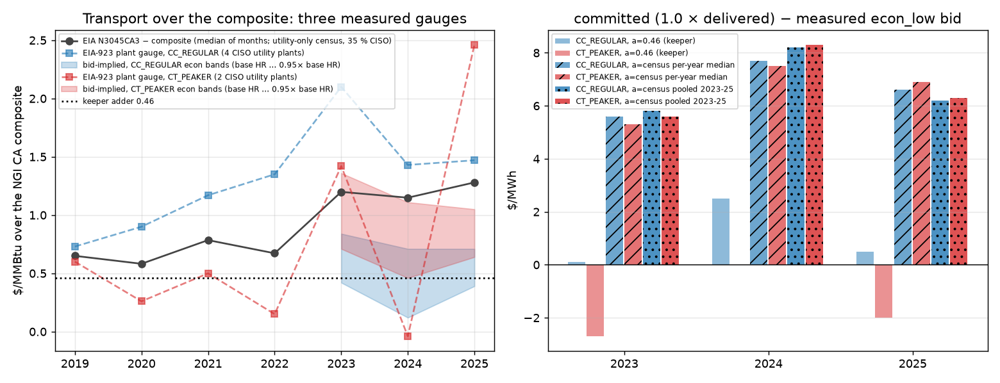

# PRECOMMIT (scoping) — R-CAISO-33: the joint gas re-basis (link 15). Zero LP. Nothing armed.

Keeper `2026-09-30-caiso-r20-overnight` (bundle `rcaiso20_A_span`, 2022–25; fold `-touchpoints` 2019–21),
unchanged. **No solve, no shard, no `ScenarioConfig` field, no cell moved, no constant changed.**
Probe: `scripts/probes/_rcaiso33_transport_basis.py` → `transport_basis.json`, `transport_basis.png` (this
directory; every input committed, ~20 s). Written and pushed **before** any derive or solve, per the handoff.

## 0. Result

1. **The keeper's two gas bases are still mismatched by exactly the adder.** The solve prices every CAISO gas
   unit at the flow-dated NGI CA composite **+ 0.46**; the measured offer multipliers were divided by the
   composite **with no adder** (`derive_caiso_offer_surface.py::_gas_staircase`). So the econ rungs of the
   measured classes are offered above the bids they encode (caiso-244 §2.2: CC 1.02 / 1.13 / 1.14×, CT 0.91 /
   1.12 / 1.08×). That part of link 15 — re-derive the denominator on the delivered basis — stands on its own.
2. **The census the handoff names is not the CAISO fleet.** EIA N3045CA3 is built from EIA-923 Schedule 2 cost
   rows, which only utility- and muni-owned plants file. In 2023–25 it is **16 plants**, and **65 % of its gas
   volume sits outside CAISO** (LADWP 32 %, SMUD 19 %, Turlock 9 %, IID 6 %); the CISO share is 35 % (PG&E's
   Gateway/Colusa, SDG&E's Palomar, NCPA Lodi, Pasadena Glenarm, Anaheim Canyon). The merchant fleet that sets
   CAISO's bids is absent. Its 2023–25 gap over the composite (1.15–1.28) is therefore a rule-14 boundary
   misalignment, not a fleet-weighted transport.
3. **The fleet's own bids identify the basis, and they sit at the keeper's 0.46, not at 1.2.** With the
   per-year measured multipliers and the identity `mult = 1 + a / (g + 0.057·P_CO2)`, the CC_REGULAR econ
   bands imply **a = 0.12–0.45** $/MMBtu over the composite (0.36–0.84 at a 5 % lower marginal heat rate);
   CT_PEAKER econ bands imply **0.46–0.93** (0.72–1.36). Re-based on composite + 0.46 the CC econ multipliers
   come out at **0.93–1.00**: the combined cycles bid their body at delivered SRMC. Re-based on composite +
   1.2 they come out at **0.82–0.91**: a whole DEB-mitigated fleet bidding below cost, which is not a
   structural reading rule 1 can carry.
4. **Moving the adder to the census value inverts the offer curve.** The `committed` tranche (1.0 × delivered,
   not measured, Lever-A lesson) would sit **+$5.3–8.3/MWh above the measured `econ_low` bid** for both CC and
   CT in every year (fig., right), and every P0 gas cost would rise ~$5–8/MWh against unchanged imports.
5. **Recommendation:** keep 0.46, re-state its identification (§4.1), re-derive the denominator on
   composite + 0.46 so the multipliers round-trip, then solve the span. The C4-2025 risk is real (§6).

## 1. What the keeper does today

| Leg | Series | Where |
|---|---|---|
| Delivered gas, P0 and P1, every gas unit, all 12 months of 2019–25 | NGI CA composite daily, flow-dated staircase, spot level **+ 0.46** | `hubs.apply_hub_basis_overlay` (`caiso_citygate_spot_level`, `_flow_date`, `_spot_coverage`) |
| Measured band multipliers (CC_REGULAR, CT_PEAKER; CC_CHP/CT_CHP/ST_GAS re-grounded on them) | `(bid − VOM) / (base_HR × (composite_flow + 0.057·P_CO2))` — **no adder** | `derive_caiso_offer_surface.py`, `caiso_offer_curve_measured.json` |
| Conditional peak ladder | same denominator, fuel-only | `caiso_offer_surface_condbinned.json` |
| Forecast years | HH trajectory + `GAS_BASIS_DIFFERENTIAL["CAISO"]` 1.20, no adder | `trajectories.py` |

The 0.46 was measured as N3045CA3 − N3050CA3 (2024), i.e. delivered minus the EIA citygate *survey*, and the
constant's comment still says the overlay reprices at N3050CA3. The overlay has been on the composite spot since
caiso-84; N3050CA3 runs 0.9–1.0 above the composite in 2024–25 (probe A). Both facts are in R-CAISO-29 §1.

## 2. Three measured gauges of the transport over the composite ($/MMBtu)

| Gauge | 2019 | 2020 | 2021 | 2022 | 2023 | 2024 | 2025 | What it measures |
|---|--:|--:|--:|--:|--:|--:|--:|---|
| **A. census** N3045CA3 − composite, median of months | 0.65 | 0.58 | 0.79 | 0.67 | 1.20 | 1.15 | 1.28 | utility-only acquisition cost, 65 % non-CAISO (§0.2) |
| **B. plant** EIA-923 plant − composite, CISO CC_REGULAR (4 plants, 2.06 GW) | 0.73 | 0.90 | 1.17 | 1.35 | 2.10 | 1.43 | 1.47 | PG&E/SDG&E/NCPA utility CCs; Palomar 2.64, Gateway/Colusa 1.47, Lodi 1.72 |
| **B. plant** CISO CT_PEAKER (2 muni plants, 0.37 GW) | 0.60 | 0.26 | 0.50 | 0.15 | 1.42 | −0.04 | 2.46 | Glenarm 3.00, Canyon 0.32 — too thin to carry a class |
| **C. bids** CC_REGULAR econ bands, base HR (0.95× HR) | — | — | — | — | 0.42–0.45 (0.82–0.84) | 0.12–0.45 (0.36–0.71) | 0.39–0.45 (0.65–0.71) | 46 resources, 11.9 GW: the marginal basis the fleet bids |
| **C. bids** CT_PEAKER econ bands | — | — | — | — | 0.71–0.93 (1.12–1.36) | 0.46–0.83 (0.72–1.11) | 0.64–0.77 (0.92–1.05) | 100 resources, 7.4 GW |
| CAISO published GHG-twin transport, by fuel region (R-CAISO-29 §0.1) | | | | 0.07–1.75 | 0.07–2.16 | 0.07–2.52 | 0.31–2.61 | the tariff itself; fleet weights not public |

Reading. A and B agree with each other (B is a subset of A) and both say ~1.2–1.5 in 2023–25 for the
*utility* plants; C says 0.1–0.9 for the *bidding* fleet. The published tariff table spans both: backbone-level
regions (PGE1/PGE7, SCE3/SCE5: 0.07–0.9) where the large merchant CCs interconnect, and local-transmission-level
regions (PGE2 2.2–2.6, SCE1/SDG1 2.5–2.6) where Palomar, Glenarm and the LADWP steamers sit. The census
over-weights the second group because only utilities report. The Jan-2023 census month (N3045 24.8 vs composite
16.2) also shows the acquisition-vs-spot timing that a cost-based bid does not carry; medians remove it.

What C cannot settle alone: the split between adder and multiplier. The bids identify only their product; the
adder additionally prices P0 and the `committed` tranche, so it has to be a *cost* term. C is used here as the
consistency test between cost candidates (does the fleet come out bidding at, or below, SRMC?), never as a fit.

## 3. What a joint re-basis does (zero LP, probe D/E)

Re-derived multipliers (annual-mean approximation; the exact values need the per-hour bids, §5 stage 1):

| Class · band | keeper (÷ composite) | ÷ (composite + 0.46) | ÷ (composite + 1.2) |
|---|--:|--:|--:|
| CC_REGULAR econ_low / econ_high / peak | 1.066 / 1.072 / 1.386 | 0.93–1.00 / 1.00 / 1.23–1.36 | 0.82–0.91 / 0.86–0.91 / 1.12–1.20 |
| CT_PEAKER econ_low / econ_high / peak | 1.103 / 1.146 / 1.154 | 1.00–1.04 / 1.06–1.07 / 1.06–1.08 | 0.87–0.94 / 0.91–0.97 / 0.91–0.98 |

Channels that move, under either option:

- **P1 econ/peak offers of the measured classes** (CC_REGULAR 24–33 TWh/yr econ, CT_PEAKER 1–3): round-trip to
  the measured bids by construction, i.e. **fall ≈ 2–14 %** from where the keeper offers them (caiso-244 §2.2).
  Same for CC_CHP / CT_CHP / ST_GAS via `caiso_offer_surface_measured_ungrounded`. The conditional ladder
  re-derives on the same basis.
- **`committed` tranche** (CC_REGULAR 16–21 TWh/yr, 40 % of the class): priced at 1.0 × delivered, so it
  follows the adder, not the bids. At 0.46 it sits −2.7 … +2.5 $/MWh from the measured econ_low (fig.); at 1.2,
  +5.3 … +8.3 in every year — the inversion §0.4 names. Most of it is floored by the RA bridge, so the volume
  effect is bounded, but its price is the LP dual whenever it is marginal.
- **P0 base cost** (the RA-bridge commitment seam): unchanged at 0.46; +$5–8/MWh on every gas unit at 1.2,
  against DSW imports that stay on the Palo Verde hub (`caiso_import_gas_coupling` reads the survey basis, not
  the adder) — the over-import / CC-belly residual (caiso-244 §3, caiso-284) moves the wrong way.
- **Not touched (rule 19, one thing at a time):** the carbon-rate leg of the same identity (caiso-242 §3.4: the
  model charges measured `emission_rate`, the derive assumes 0.057 × tranche HR); the fuel-invariant-margin
  flatness object (caiso-242 §3.5); `GAS_BASIS_DIFFERENTIAL["CAISO"]` (forecast path); the ST_GAS per-plant
  registries (caiso-239/240, physical heat-rate multipliers, which scale with delivered gas as they should).

## 4. The identification, frozen (whichever option the owner selects)

### 4.1 Option 1 (recommended) — keep 0.46, repair the denominator

- `CAISO_CITYGATE_TRANSPORT_ADDER` stays **0.46**, applied as today. Its identification is re-stated in the
  constant's comment: a citygate→burner-tip transport on the NGI CA composite base, bounded by the fleet's
  measured bids (0.12–0.93 across CC/CT econ bands, probe C), consistent with CAISO's published backbone-level
  GHG-twin transports (0.07–0.9), and **below** the utility-only census (1.15–1.28) whose composition is
  documented as the rule-14 misalignment. The DOF ledger entry stays measured-physical; no value is chosen.
- `derive_caiso_offer_surface.py::_gas_staircase` returns `composite_flow + CAISO_CITYGATE_TRANSPORT_ADDER`
  (imported, never a literal); static and ladder stages unchanged otherwise; `_provenance.gas_basis` names the
  basis. G1–G4 gates, `hr_cut` 8.5, `st_cut` search, Theil–Sen classifier, VOM, carbon: all unchanged (rule 23:
  the re-derive is a basis reconciliation, cited as such in the commit; no source data changes).
- **G-RT (round-trip), pre-registered:** for every consumed class and band, per year,
  `mult_new × base_HR × (ḡ_y + 0.46 + 0.057·P_y)` must reproduce `mult_keeper,y × base_HR × (ḡ_y + 0.057·P_y)`
  within **±$0.75/MWh** (pooled medians move by the per-hour non-linearity; the bound is the derive's own LOYO
  tolerance 0.08 at CC base HR and 2024 gas). Failure ⇒ stop, report, no solve.
- **Expected direction, stated before the solve:** gas econ offers fall 2–14 %; CC belly and evening gas rise;
  C3a (model +4.7–8.6 % over RT) falls; C1 CC_REGULAR improves in 2023; **C4 gas NRMSE rises** (the caiso-267/268
  sign: a 8 % fossil-offer cut took 2025 from 0.298 to 0.308). Promotion rule: the structure rule of
  R-CAISO-20 PRECOMMIT §6 — promote if no load-bearing criterion flips to FAIL on the span and the fold does not
  lose a criterion; a C4-2025 FAIL is **NOT-YET**, reported, and goes to a card, never swept.

### 4.2 Option 2 — census re-basis (the handoff's literal ask)

- Adder = per-year median of (N3045CA3 − composite_flow) months: **2019 0.65, 2020 0.58, 2021 0.79, 2022 0.67,
  2023 1.20, 2024 1.15, 2025 1.28** (`GAS_BASIS_DIFFERENTIAL_MEASURED_BY_YEAR` precedent, a new CAISO table;
  forward years hold the last value). Denominator = composite_flow + adder(year). G-RT as above with the
  year's adder. Carried risks, stated: multipliers 0.82–0.98 (§3), committed inversion +5–8 $/MWh, P0 +5–8
  $/MWh against unchanged imports; the identification rests on a census that is 65 % non-CAISO.
- A pooled single value (1.22) is **not** offered: it would over-price 2019–22 by ~0.5 against the same census.

### 4.3 Refused at scoping

- Identifying the adder from the bids (circular with the multipliers; §2 last paragraph).
- Per-class or per-plant adders from gauge B (4 + 2 utility plants; the bid gauge covers 19 GW and disagrees).
- Arming the measured `committed` band to remove the inversion (Lever-A lesson, rule 19; caiso-241 ruling).

## 5. Execution plan (rules 32–36), for either option

1. **Stage 1, one data shard, zero LP (~3 h):** fetch the DAM 2023–25 public-bid zips
   (`scripts/data/fetch_caiso_public_bids.py`, 1,096 dates, ~0.4 GB, 6 s spacing), rebuild the reduced store
   (`scripts/probes/_caiso253b_ct_bucket_bimodality.py --pass1`), run
   `derive_caiso_offer_surface.py --from-reduced-store --st-split-report-only` on the re-based staircase, push
   the two JSONs + `_provenance` and the G-RT table. The zips are gitignored and the reduced store is not on disk
   (`results/rtm-intake/caiso283/` holds only old-basis medians, which cannot be re-based exactly).
2. Parent verifies G1–G4 and G-RT from the pushed artifact; G-DRIFT (rule 29(b)) on HEAD vs the keeper's SHA.
3. **Stage 2, seven solve shards** (2019–2025, one per year, `scripts/shard_prompt.py --all-years` from the
   stage-1 SHA, `replay_keeper` on `rcaiso20_A_span` / `_tp_2019_2021`, no `--set` needed: the constant and the
   artifact are on the SHA). Each pushes its full bundle (rule 34).
4. Parent composes, scores (`calibration_verdict`), registers, and promotes or cards (rule 35 / 31).

## 6. C4-2025 risk, stated

Keeper C4 gas NRMSE 0.252 / 0.247 / 0.247 / **0.288** (2022–25) against ≤ 0.30. caiso-257 recorded 2025 at
0.300 with zero margin; the keeper has 0.012. The only prior move of the same sign and size (caiso-267/268, ×0.92
fossil offers) cost +0.010. Option 1 is that move, measured rather than tuned; a 2025 FAIL is a live outcome and
would make the span NOT-YET on C4 alone (supporting tier, but a FAIL downgrades). The fold (2019–21) is already
NOT-YET and is not expected to change status.

## 7. Decision

Owner decision card (one of: option 1 now · option 2 now · freeze and queue after links 16–17 · close,
keep 0.46 and the keeper as is).

## Sources

- EIA N3045CA3, N3050CA3 (`data/raw/gas-prices/`); EIA-923 Schedule 2 plant costs
  (`data/raw/_processed-legacy/eia923_monthly_fuel_costs.parquet`); EIA-860 plant table (owner, BA).
- NGI CA composite (`caiso_citygate_daily.csv`, licence flag in the gas-prices README).
- `data/raw/_validation-source/caiso_offer_curve_measured.json` `_provenance.per_year_band_mults`.
- CAISO Gas Price Template 2025/2026 and OASIS `PRC_FUEL` (R-CAISO-29 FINDING).

## Retrievability (rule 34(e))

Nothing was solved. The probe re-reads committed files only.

## 8. Owner ruling

Decision card, 2026-10-02: **"Keep 0.46, repair denominator, solve"** (option 1, §4.1). Not selected: the
census re-basis (§4.2), freeze-and-queue, close. Execution follows §5 in this session: stage 1 (re-fetch the
DAM 2023–25 bids, rebuild the reduced store, re-derive on composite + 0.46, G-RT), then seven solve shards.
The ruling is in force for the chain; the adder's identification is re-stated on the constant (§4.1).

## 9. G-DRIFT (rule 29(b)), keeper pin `cd589798` → HEAD `b19f3d5e`

Zero-LP code audit over 159 changed files on the solve path. **Zero LIVE hunks** for a CAISO backcast replay:
110 files are AST-identical (the `docs/handoffs → docs/records` path rewrite in comments); the 49 code-changed or
new files are gated behind another ISO branch (PJM gas bridge, ERCOT SWCAP/ORDC, NYISO Transco flow-date, SPP MMU
bands, SOCO neighbour tables, captive coal, measured oil burn) or behind one of 12 new `ScenarioConfig` fields,
all default-off and registered at default in the cache key; no existing default moved; the one deleted field
(`cc_subfloor_eia923_heat_rates`) was False on the keeper and is absent from its recipe. `calibration_verdict.py`
is AST-identical; `legitimacy_diagnostics.py` only adds the PJM bridge mechanism id. Data on the path: the EIA-860
2019/2020 vintages gained 11 OVEC (PJM) rows each, CISO rows identical; `actual_lmp.json` CAISO leaves unchanged.
One additive output: every solve now also writes `hourly/unit_marginal_<year>.parquet` (rule 15). CAISO's cache
key does not move (the 10 CAISO solve-surface rows hash identically); only the informational `solve_surface.json`
fingerprint changes. **No control solve is earned; the committed keeper is the control.**
