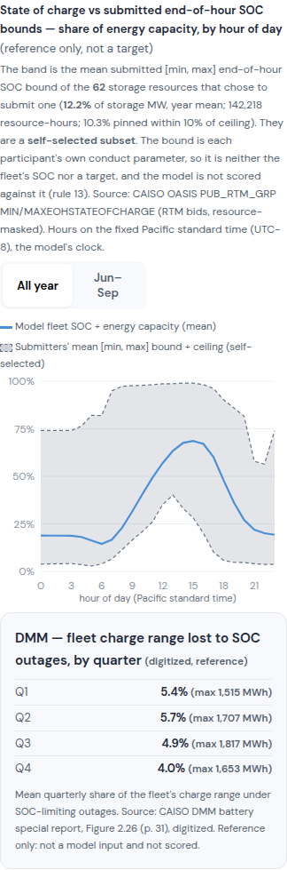

# R-CAISO-34 — Run Explorer storage panel: submitted SOC-bound envelope (link 16)

Date 2026-10-02. **Display only.** Zero LP, no shard, no `ScenarioConfig` field, no constant, no keeper change.
The owner selected this link in R-CAISO-31 FINDING §4 (option 2).

## 1. What was built

The Run Explorer storage panel ("Storage Dispatch — Model vs Actual", Charts view) gains a sub-section for
every CAISO year with an RTM end-of-hour SOC-bound extract (2023–25):

- **Band.** By hour of day, the submitters' mean [min, max] end-of-hour SOC bound, as a share of each
  resource's ceiling. The ceiling is the year max of `max_eoh_soc_mwh`, which tracks energy capacity
  (R-CAISO-28 §1).
- **Line.** The model's li-ion fleet SOC as a share of its energy capacity (P1, from the bundle's
  `hourly/storage_<year>.parquet`).
- **Toggle.** All year or Jun–Sep.
- **Caption.** Each year shows its submitter count, their share of storage MW, the resource-hours, and the
  pinned share. The text says the band is a **self-selected subset**, is each participant's own conduct
  parameter, is **neither the fleet's SOC nor a target**, and is not scored (rule 13).
- **DMM card.** The R-CAISO-32 digitized DMM quarterly SOC-outage shares sit below the chart, labelled
  "digitized, reference" (2023 and 2024 only; the DMM has no 2025 report). The owner neither selected nor
  refused this option, so it ships for the owner's card (§4).
- **No fit statistic.** The panel computes nothing against the band, by design.

## 2. Where it lives

- **Data.** `scripts/lib/storage_compare.py::build_soc_bounds` adds an optional `storageCmp.socBounds` block.
  It is absent (not null) for any ISO-year without an extract, so other payloads render as before. It reads
  only committed inputs:
  - the raw extract `data/raw/caiso-rtm-eoh-soc/`;
  - the bundle's storage sidecar;
  - `docs/records/caiso/r-caiso-32/dmm_soc_outage_digitized.json`.

  Every future `render_calibration_html.py` render carries the block natively, including the next CAISO
  promotion.
- **Clock.** The envelope is built on the **model's clock**: fixed Pacific standard time (`Etc/GMT+8`), the
  same clock as the storage sidecar and the actuals series. The R-CAISO-31 probe binned the envelope on
  Pacific prevailing time while the model ran on standard time. That shifted summer by 1 h, and the panel
  removes the shift. Every other part of the method is identical to
  `scripts/probes/_rcaiso31_eoh_soc_diagnostic.py`.
- **Coverage.** The figures reproduce the intake README: 30 / 62 / 95 submitters, and 2.7 / 12.2 / 19.8 % of
  storage MW.
- **Frontend.** `docs/codebase-site/js/backcast-runs.js::drawSocBounds` is a d3 SVG chart with an HTML legend
  that wraps at phone width. It was checked headless at 1300 px and 390 px.
- **Current keeper payload.** A full re-render needs the bundle's gitignored `system.parquet`, which a
  committed keeper bundle does not carry. Instead, `scripts/probes/_rcaiso34_inject_soc_bounds.py` adds the
  block to the committed `runs/2026-10-02-closeout-caiso-w1-arm3.js` with the same library function.
  - The probe first checks that a decode → encode of the untouched payload reproduces the file byte for byte.
  - After injection, the payload with `socBounds` removed equals the original exactly.

## 3. Observation (descriptive, not a gate)

In 2023–25, the model fleet's mean SOC share stays inside the submitters' mean band at all 24 hours.

| year | model SOC share range | band min | band max |
|---|---|---|---|
| 2023 | 0.18–0.61 | 0.13 | 0.92 |
| 2024 | 0.14–0.69 | 0.03 | 0.99 |
| 2025 | 0.13–0.72 | 0.03 | 0.97 |

The band is wide, and its submitters are a minority of the fleet. So this is not evidence of fit, and no
lever follows from it.

## 4. Owner card

The decision is ship as rendered, or changes. The answer is recorded in §5.

## 5. Owner ruling

Decision card, 2026-10-02: **Ship as rendered**, with the DMM quarterly card included. Link 16 is closed.
No cell is moved and no lever follows. Link 17 (R-CAISO-35, the battery-outage census) is next.
