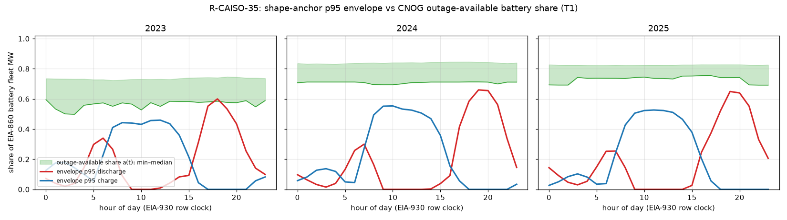

# FINDING — R-CAISO-35 (link 17): battery-outage census; the shape anchor already carries the outage MW

Keeper unchanged (`frontend/data/backcast/keepers/CAISO.json`). **Zero LP, no shard, no `ScenarioConfig` field, no
constant, no matrix cell moved.** The test and its reading were pre-registered in
`PRECOMMIT-r-caiso-35-battery-outage-census-2026-10-02.md` (pushed at `70a63570`) before anything was computed.
Probe: `scripts/probes/_rcaiso35_battery_outage_census.py` → `battery_outage_census.json`; figure
`envelope_vs_outage_available.png`.

## 0. Result

**T1 reads CARRIED.** In 26,280 hours (2023–25), the `caiso_storage_shape_anchor` p95 envelope exceeds the share of
the battery fleet that CNOG outages leave available in **4 hours**, all in 2023 discharge (0.046 %; bar ≤ 1 %).
Charge never touches it, and 2024 and 2025 never do. Both sensitivities read 0.0 %.

| | 2023 | 2024 | 2025 |
|---|--:|--:|--:|
| EIA-860 battery fleet, mean MW | 5,554 | 9,347 | 13,242 |
| CNOG battery MW offline, mean / p99 | 1,409 / 2,224 | 1,516 / 2,252 | 2,278 / 3,235 |
| Offline share `o`, EIA-860 basis: mean / p99 / max | 25.8 / 40.3 / 50.2 % | 16.6 / 27.6 / 30.6 % | 17.4 / 24.9 / 30.8 % |
| Offline share, RTM bidding-fleet basis (R-CAISO-32 Part B), mean | 21.4 % | 14.4 % | 14.5 % |
| Envelope p95 max, charge / discharge | 0.46 / 0.60 | 0.55 / 0.66 | 0.53 / 0.65 |
| Least headroom `a − e`, charge / discharge | +9.1 / **−1.5** pp | +14.0 / +5.3 pp | +21.0 / +9.3 pp |
| **T1 B**, primary: hours with `e > a`, charge / discharge | 0 / 0.046 % | 0 / 0 | 0 / 0 |
| T1, RTM-fleet denominator | 0 / 0 | 0 / 0 | 0 / 0 |
| T1, crosswalk-accepted resources only | 0 / 0 | 0 / 0 | 0 / 0 |
| T2: measured dispatch above the available share | 0 / 0.046 % | 0 / 0 | 0 / 0 |
| T3: within-quarter Spearman, daily `o` vs peak discharge (Q1–Q4) | −0.05 / +0.03 / +0.13 / +0.23 | +0.30 / −0.45 / +0.15 / −0.20 | +0.08 / −0.12 / +0.24 / +0.23 |

**Reading (pre-registered, PRECOMMIT §4):** the envelope sits beneath the outage-available fleet in effectively every
hour. It already carries the battery MW-outage phenomenon. A consumer stacked on it would remove the outaged MW twice
(rule 19), so none is proposed. The census and the crosswalk stay as documented reference inputs.

## 1. Why it carries

- **Structure (PRECOMMIT §1).** The envelope is realized EIA-930 battery output ÷ the full EIA-860 fleet. An outaged
  unit contributes zero to the numerator and its full MW to the denominator, so the p95 already measures capability
  net of the outages in force.
- **Numbers.** Outages remove 17–26 % of EIA-860 fleet MW on average and at most 31 % (2024–25). The real fleet never runs
  near what is left: at its p95 the fleet discharges 0.60–0.66 of nameplate and charges 0.46–0.55. The gap between
  the two is AS holdback, DA-bid conservatism and commissioning ramps, the drivers the anchor's docstring names.
  Outages live inside that gap.
- **The 4 hours.** All four are hod 18 of 2023 (12 Mar, 8 May, 11–12 Jul). Outages run at 40–42 % of the EIA-860
  fleet there, and the envelope (0.600) passes the available share (0.585–0.598) by ≤ 1.5 pp. T2 also finds 4 hours in 2023 hod 18
  (8 and 13 May, 30 Jun, 12 Jul) where **measured** discharge exceeded the available share by ≤ 2.1 pp, two of them
  the same hours. Realized output above what the outages supposedly left is impossible physically, so at that
  margin the CNOG MW and the EIA-860 nameplate basis disagree (the 2023 fleet is the smallest and its commissioning
  ramp the steepest). The 4 T1 hours sit inside that basis error rather than marking MW the envelope wrongly grants. They do not cross the T2 caveat bar (1 %).
- **T3** has no consistent sign (−0.45 to +0.30). Day-to-day outage depth does not move realized peak dispatch. That
  is what CARRIED predicts: the fleet's binding limit is behavioural headroom, not outages.

## 2. The crosswalk (deliverable)

`scripts/data/build_caiso_resource_crosswalk.py --storage` writes the **sibling** file
`data/raw/reference/caiso-storage-resource-eia-crosswalk.csv`. It maps each CNOG battery resource to an EIA-860
energy-storage operable plant in a CAISO zone. Matching uses the existing name-token score with the technology
tokens dropped, plus the thermal builder's threshold (0.6) and capacity sanity, unchanged as pre-registered.
`load_crosswalk` (the thermal overlay's only reader) never sees it, and it has no consumer.

- 176 resources, 64 accepted, on 57 EIA-860 plants. The census selector finds 177. The missing one is
  `RATSKE_2_WAVBT1`: its episodes carry two names, and the builder groups by the first one ("Willy 9 Antelope Valley
  Complex"), which has no storage token. Its id suffix `WAVBT1` also misses the `_BT<digit>` pattern.
- **Coverage is thin:** accepted resources carry 19 / 31 / 19 % of census offline MW-h (2023 / 24 / 25). Hybrid
  BESS names ("Garland B BESS" → "RE Garland", "Gateway Energy Storage" → "Gateway Energy Storage System") score
  just under 0.6 with exact MW. A review pass would lift coverage. It is not done, because no per-resource consumer
  exists, and T1 is fleet-level and reads CARRIED on both populations.

## 3. Corrections to the PRECOMMIT text (no effect on the test)

- §2 says "Feb 29 dropped as the derive does (first 8760 rows)". The derive keeps the **first 8760 rows**, so in
  2024 it drops 30–31 Dec, not 29 Feb. The probe follows the derive exactly. Where EIA-930 is short of 8760 rows,
  the probe zero-pads the clock in the same way.
- The test bands, populations and denominators are as pre-registered.

## 4. Matrix and rules

- No field, so no cell. The CAISO shard is untouched. `storage_measured_anchors` (K) is confirmed, not re-opened:
  this adds evidence that its shape anchor already embeds the outage MW.
- Rule 13: the census is an admissible measured input, used here only as a test.
- Rule 19: satisfied by **not** building.
- Rule 23: the envelope and its derive are unchanged.

## 5. Decision

Nothing to promote. The options go to the owner as a decision card (§6).

## 6. Owner ruling

Decision card, 2026-10-02 (multi-select):

1. **Close link 17 report-only.** No consumer, field or cell. The census JSON and the storage crosswalk stay
   committed as reference inputs. Evidence is added to `storage_measured_anchors` (CAISO K) with no verdict move.
2. **Review the battery crosswalk later.** This is queued as the next link, **R-CAISO-36** (owner's next-link
   choice: crosswalk review). It is zero LP. It lifts accepted coverage beyond 19–31 % of offline MW-h without
   changing the pre-registered threshold after the fact: matches are reviewed by hand and recorded with a stated
   reason per row.

Not selected: the envelope-net replacement route.
